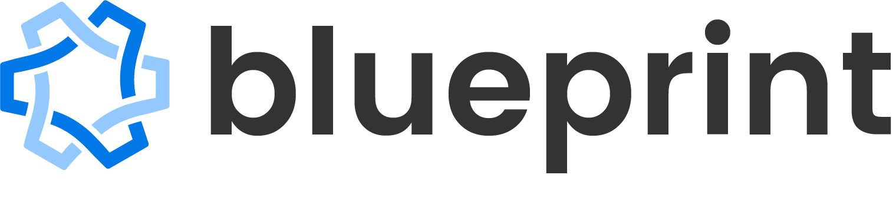
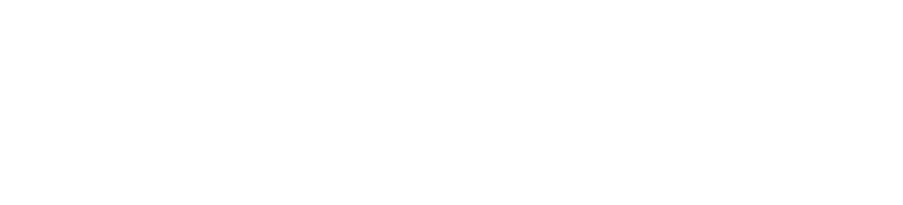

# Blueprint Brand Assets

## Our Name
“**Blueprint**” is one word, spelled with a big B and a little p.

In our logos, it is spelled entirely in lowercase, to give a friendlier feel.

---

## Our Logo
There are 3 possible orientations for our logo (with full-color and negative for each).

---

## Banner Logo
### Full Color Banner

logo/banner.png

### Negative Banner

ogo/banner_negative.png
  
---

## Square Logo
### Full Color Square

logo/square.png

### Negative Logo

logo/square_negative.png

---

## Standalone Logo
### Full Color Banner

logo/square.png

### Negative Standalone Logo

logo/square_negative.png

---
## Our Colors

 Primary Blue: #0078E8

 Secondary Blue: #93C9FE

 Text Color: #333333

 Negative: #FFFFFF

---

## Our font
We use Poppins, a Google font.

https://fonts.google.com/specimen/Poppins

In logos, the font is Poppins semi-bold 600.

---

## Please do
Provide plenty of space around the Blueprint logo. Make it big, make it small, just give it the chance to breathe and not feel cluttered.