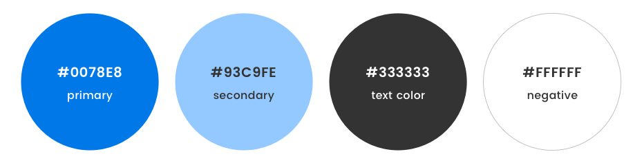

# Blueprint Brand Assets

## Our Name
“**Blueprint**” is one word, spelled with a big B and a little p.

In our logos, it is spelled entirely in lowercase, to give a friendlier feel.

---

## Our Logo
There are 3 possible orientations for our logo (with full-color and negative for each).

---

## Banner Logo
### Full Color Banner

* file: [/logo/banner.png](/logo/banner.png)

### Negative Banner

* file: [/logo/banner_negative.png](/logo/banner_negative.png)
  
---

## Square Logo
### Full Color Square

* file: [logo/square.png](logo/square.png)

### Negative Square Logo

* file: [logo/square.png](logo/square.png)

---

## Standalone Logo
### Full Color Standalone

* file: [/logo/square.png](/logo/square.png)

### Negative Standalone Logo

* file: [/logo/square_negative.png](/logo/square_negative.png)

---
## Our Colors

```
Primary Blue: #0078E8
Secondary Blue: #93C9FE
Text Color: #333333
Negative: #FFFFFF
```

---

## Our font
We use Poppins, a Google font.

file: https://fonts.google.com/specimen/Poppins

In logos, the font is Poppins semi-bold 600.

---

## Please do
Provide plenty of space around the Blueprint logo. Make it big, make it small, just give it the chance to breathe and not feel cluttered.